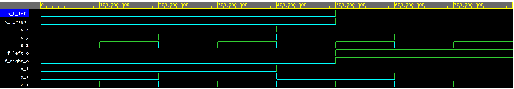

# Lab 1: Gabriel Mastny

### De Morgan's laws

1. Equations of all three versions of logic function f(c,b,a):

   

2. Listing of VHDL architecture from design file (`design.vhd`) for all three functions. Always use syntax highlighting, meaningful comments, and follow VHDL guidelines:

```vhdl
architecture dataflow of demorgan is
begin
    f_o      <= not b and a or not c and not b;
    f_nand_o <= not (not (not b and a) and (not (not c and not b)));
    f_nor_o  <= (not (b or not a) or (not (c or b)));
end architecture dataflow;
```

3. Complete table with logic functions' values:

| **c** | **b** |**a** | **f(c,b,a)** | **f_NAND(c,b,a)** | **f_NOR(c,b,a)** |
| :-: | :-: | :-: | :-: | :-: | :-: |
| 0 | 0 | 0 | 1 | 1 | 1 |
| 0 | 0 | 1 | 0 | 0 | 0 |
| 0 | 1 | 0 | 0 | 0 | 0 |
| 0 | 1 | 1 | 0 | 0 | 0 |
| 1 | 0 | 0 | 1 | 1 | 1 |
| 1 | 0 | 1 | 1 | 1 | 1 |
| 1 | 1 | 0 | 0 | 0 | 0 |
| 1 | 1 | 1 | 0 | 0 | 0 |

### Distributive laws

1. Screenshot with simulated time waveforms. Always display all inputs and outputs (display the inputs at the top of the image, the outputs below them) at the appropriate time scale!

   

2. Link to your public EDA Playground example:

   [https://www.edaplayground.com/...](https://www.edaplayground.com/x/jgjC)
